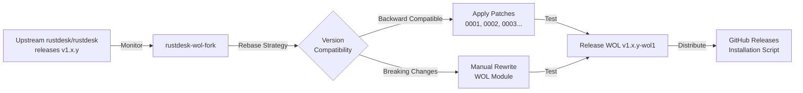
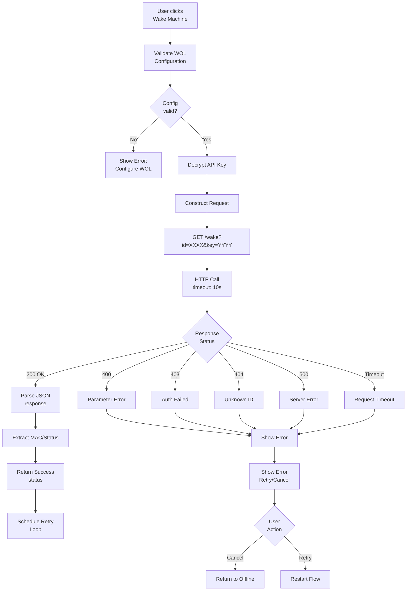
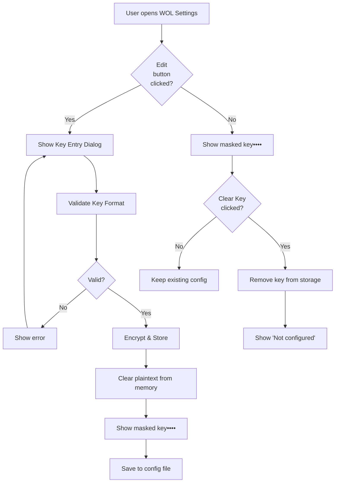
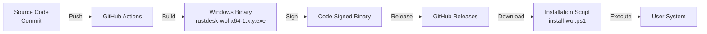

# Phase 2 Design: Custom RustDesk Client Integration with WOL

**Document Date:** 2026-02-10

**Status:** Design Document (Ready for Review & Implementation Planning)

**Phase 2 Objective:** Enable offsite users to automatically wake sleeping machines through a custom RustDesk Windows client integrated with the Phase 1 WOL Proxy API.

**Current Architecture Reference:** Phase 1 Backend API operational at `10.10.10.145:5001`

---

## Table of Contents

1. [Executive Summary](#executive-summary)
2. [Requirements & Constraints](#requirements--constraints)
3. [RustDesk Codebase Analysis](#rustdesk-codebase-analysis)
4. [Fork Strategy & Modification Points](#fork-strategy--modification-points)
5. [WOL Detection State Machine](#wol-detection-state-machine)
6. [API Invocation Flow & Retry Logic](#api-invocation-flow--retry-logic)
7. [Configuration & Key Storage](#configuration--key-storage)
8. [UI/UX Integration](#uiux-integration)
9. [Security Architecture](#security-architecture)
10. [Cross-Platform Considerations](#cross-platform-considerations)
11. [Testing Strategy](#testing-strategy)
12. [Binary Distribution & CI/CD](#binary-distribution--cicd)
13. [Implementation Milestones](#implementation-milestones)
14. [Risk Analysis](#risk-analysis)
15. [Appendices](#appendices)

---

## Executive Summary

Phase 2 extends the RustDesk Auto-WOL solution by creating a custom Windows client that integrates with the Phase 1 WOL Proxy API. The custom client detects when a connection attempt fails due to the target machine being offline, provides users with a UX "Wake Machine" button, and automatically handles the wake-and-retry flow.

### Key Decisions

- **Platform Focus:** Windows desktop client (RustDesk official Windows binary as base)
- **Fork Scope:** Minimal modifications to upstream code (UI additions + WOL integration layer)
- **API Key Storage:** Encrypted local file storage (AES-256) in RustDesk config directory
- **User Interaction:** Manual "Wake Machine" button with connection retry feedback
- **Binary Distribution:** GitHub releases with auto-update script support
- **Build Process:** Leverage existing RustDesk CI/CD with custom patches

### Success Criteria

- ✅ Custom Windows client installable alongside standard RustDesk
- ✅ User can click "Wake Machine" button when connection fails
- ✅ Client invokes Phase 1 API with proper authentication
- ✅ Automatic retry logic waits for machine boot (configurable 20-120 seconds)
- ✅ User feedback shows "Waking machine...", "Waiting for response...", success/failure states
- ✅ API key never exposed in logs or error messages
- ✅ Less than 500KB binary size difference from standard RustDesk
- ✅ Full Windows implementation ready for Phase 3 expansion to macOS/Linux

---

## Requirements & Constraints

### Functional Requirements

| ID | Requirement | Priority | Description |
|----|----|----------|---|
| FR-1 | Connection Failure Detection | HIGH | Detect when RustDesk connection fails (timeout, refused, offline) |
| FR-2 | WOL Button Integration | HIGH | Add "Wake Machine" button to failed connection dialog |
| FR-3 | API Invocation | HIGH | Call Phase 1 API endpoint `/wake?id=<id>&key=<key>` |
| FR-4 | Retry Logic | HIGH | Wait N seconds, retry connection M times |
| FR-5 | User Feedback | HIGH | Display status: "Waking...", "Waiting for boot...", result |
| FR-6 | Config Panel | MEDIUM | Settings UI for API URL, API key, retry parameters |
| FR-7 | Persistent Config | MEDIUM | Save settings to encrypted file |
| FR-8 | Error Handling | MEDIUM | User-friendly errors without exposing internals |

### Non-Functional Requirements

| ID | Requirement | Target | Description |
|----|----|----------|---|
| NFR-1 | Fork Diff Minimization | <50 modified files | Reduce maintenance burden |
| NFR-2 | Binary Size | <10MB delta | Limit distribution size |
| NFR-3 | Startup Time | <100ms overhead | No performance degradation |
| NFR-4 | Response Time | <5s for API call | User-acceptable wait |
| NFR-5 | API Key Security | AES-256 encryption | No plaintext key storage |
| NFR-6 | Code Maintainability | Isolated modules | Separate WOL logic from core |

### Constraints

- **Windows-only for Phase 2** (future: macOS/Linux support)
- **Based on RustDesk upstream** (Fork maintained separately)
- **No breaking changes** to RustDesk core functionality
- **Backward compatible** with standard RustDesk installations
- **Requires .NET Framework 4.6+** (or separate Rust-based implementation)
- **No external dependencies** beyond what RustDesk already uses

### Assumptions

- Phase 1 API is stable and running at known endpoint
- Users have the API key distributed securely (manual process)
- RustDesk IDs are stable (no renaming during WOL process)
- Target machines support WOL and have it enabled
- Windows firewall allows outbound HTTP (or configured for HTTPS via proxy)

---

## RustDesk Codebase Analysis

### RustDesk Architecture Overview

```
rustdesk/
├── src/
│   ├── main.rs                    # Entry point
│   ├── ui/
│   │   ├── ui_main.h/ui_main.cc   # Main UI logic (C++, wxWidgets or Qt)
│   │   ├── connection_window.cc    # Connection UI
│   │   └── settings.cc             # Settings panel
│   ├── connection.rs               # Connection management
│   ├── client.rs                   # RustDesk protocol client
│   ├── hbbs_http.rs               # HBBS communication
│   ├── windows/ (Windows-specific)
│   │   ├── service.rs             # Windows service
│   │   └── tray.rs                # System tray
│   └── config.rs                  # Configuration management
├── res/ (Resources)
├── Cargo.toml                     # Rust dependencies
└── build scripts
```

### Key Components for Phase 2

#### 1. Connection State Management

**File:** `src/connection.rs`

**Current Behavior:**
- Manages connection lifecycle (connecting → connected → disconnected)
- Handles connection timeouts
- Emits events to UI on state changes

**Our Modifications:**
- Add `WOLTriggered` state
- Add connection failure reason tracking
- Emit event when connection fails due to offline status

#### 2. UI Layer - Connection Dialog

**File:** `src/ui/*.cc` (C++/wxWidgets or Qt depending on platform build)

**Current Behavior:**
- Displays connection status (Connecting, Connected, Disconnected)
- Shows connection errors
- Allows manual retry

**Our Modifications:**
- Add "Wake Machine" button (visible when connection fails)
- Add WOL status display
- Implement callback handler for button click

#### 3. Configuration Management

**File:** `src/config.rs`

**Current Behavior:**
- Loads/saves RustDesk settings from registry (Windows) or config files
- Manages connections, themes, accessibility options

**Our Modifications:**
- Add WOL configuration section
- Add encrypted key storage/retrieval
- Add WOL API endpoint configuration

#### 4. Async Runtime

**Dependency:** Tokio (already used by RustDesk for async I/O)

**Our Use:**
- No new dependency needed
- Use existing async runtime for HTTP calls
- Leverage existing error handling patterns

---

## Fork Strategy & Modification Points

### Repository Structure

```
rustdesk-wol-fork/
├── .git/                          # Git history (forked from rustdesk/rustdesk)
├── src/
│   ├── wol_client.rs              # NEW: WOL client logic
│   ├── wol_config.rs              # NEW: WOL configuration
│   ├── wol_ui.rs                  # NEW: WOL UI integration
│   ├── connection.rs              # MODIFIED: Add WOL state
│   ├── config.rs                  # MODIFIED: Add WOL settings
│   ├── main.rs                    # MODIFIED: Initialize WOL module
│   ├── ui/ (Various files)        # MODIFIED: Add WOL UI
│   └── ...
├── patches/                       # NEW: Unified diffs for modifications
│   ├── 0001-add-wol-module.patch
│   ├── 0002-ui-integration.patch
│   └── 0003-config-storage.patch
├── src_wol/ (Optional)            # NEW: Pure Rust WOL-specific source
├── build-wol.sh                   # NEW: Build script for custom binary
├── .ci/                           # MODIFIED: CI/CD for custom builds
└── VERSION_WOL                    # NEW: WOL fork version tracking
```

### Modification Strategy: "Minimal Diff Approach"

**Goal:** Keep fork synchronized with upstream while maintaining WOL features

**Implementation:**
1. **Isolated WOL Module** (`wol_client.rs`, `wol_config.rs`, `wol_ui.rs`)
   - Self-contained, minimal coupling to RustDesk core
   - Version-independent logic
   - Easy to port across RustDesk versions

2. **Patch-Based Integration** (not direct edits)
   - Use git patches for core modifications
   - Enables easy rebase on new RustDesk versions
   - Maintains clear commit history

3. **Feature Flag (Optional for Phase 3)**
   - Conditional compilation: `#[cfg(feature = "wol")]`
   - Allows building standard RustDesk without WOL
   - Simplifies upstream contribution discussion

### Specific Modification Points

#### Point 1: Connection State Machine (`src/connection.rs`)

**Current Code (Pseudocode):**
```rust
enum ConnectionState {
    Connecting,
    Connected,
    Disconnected,
}

fn try_connect() {
    // Connection logic
    match result {
        Ok => setState(Connected),
        Err => setState(Disconnected),
    }
}
```

**Modification:**
```rust
enum ConnectionState {
    Connecting,
    Connected,
    Disconnected,
    OfflineWOL,        // NEW: WOL attempt pending
    OfflineWOLWaiting, // NEW: Waiting for boot after WOL
}

fn try_connect() {
    match result {
        Ok => setState(Connected),
        Err => {
            if should_trigger_wol() {
                setState(OfflineWOL);  // NEW
                trigger_wol_flow();    // NEW
            } else {
                setState(Disconnected);
            }
        }
    }
}
```

**Line Impact:** ~30-50 lines of new/modified code in `connection.rs`

#### Point 2: UI Dialog (`src/ui/connection_window.cc`)

**Current Code (Pseudocode):**
```cpp
void ConnectionWindow::ShowError(const QString& message) {
    errorLabel->setText(message);
    retryButton->show();
}
```

**Modification:**
```cpp
void ConnectionWindow::ShowError(const QString& message) {
    errorLabel->setText(message);
    retryButton->show();
    if (WolModule::isConfigured()) {
        wolButton->show();  // NEW
    }
}

void ConnectionWindow::OnWolClick() {  // NEW
    WolModule::attemptWakeAndRetry(peerID);
    updateStatusLabel("Waking machine...");
}
```

**Line Impact:** ~20-40 lines added to UI handler

#### Point 3: Configuration (`src/config.rs`)

**Current Code (Pseudocode):**
```rust
struct Config {
    peer_id: String,
    connection_timeout: u64,
    // ...
}
```

**Modification:**
```rust
struct Config {
    peer_id: String,
    connection_timeout: u64,
    // Standard fields
    
    #[serde(default)]
    wol_config: WolConfig,  // NEW
}

struct WolConfig {  // NEW
    enabled: bool,
    api_url: String,
    api_key_encrypted: String,  // AES-256 encrypted
    retry_count: u32,
    retry_delay_seconds: u32,
}
```

**Line Impact:** ~50 lines in config structures

#### Point 4: Initialization (`src/main.rs`)

**Current Code (Pseudocode):**
```rust
fn main() {
    initialize_logging();
    load_config();
    initialize_ui();
    run_event_loop();
}
```

**Modification:**
```rust
fn main() {
    initialize_logging();
    load_config();
    #[cfg(feature = "wol")]  // NEW
    initialize_wol_module();  // NEW
    initialize_ui();
    run_event_loop();
}
```

**Line Impact:** ~5 lines

### Fork Maintenance Process



**Rebase Schedule:** Quarterly or upon major RustDesk releases

---

## WOL Detection State Machine

### Connection Failure Flow

```mermaid
stateDiagram-v2
    [*] --> Idle: App Start
    
    Idle --> Connecting: User clicks peer
    Idle --> Settings: User opens settings
    
    Connecting --> Connected: Success
    Connecting --> Offline: Timeout/Refused (5s)
    
    Connected --> [*]: User disconnects
    
    Offline --> CheckWOLConfig{WOL enabled?}
    CheckWOLConfig -->|No| ShowError: Show error message
    CheckWOLConfig -->|Yes| ShowWOLOption: Show "Wake Machine" button
    
    ShowError --> Idle: User closes
    ShowWOLOption --> Idle: User closes
    
    ShowWOLOption --> UserInitiatesWOL: User clicks button
    UserInitiatesWOL --> SendingWOL: Sending to API
    SendingWOL --> APIResponse{Response OK?}
    
    APIResponse -->|Yes| WaitingForBoot: Waiting 20-30s
    APIResponse -->|No| WOLError: Show error
    
    WaitingForBoot --> RetryConnection: Auto-retry
    RetryConnection --> ConnectAttempt{Connected?}
    
    ConnectAttempt -->|Yes| Connected
    ConnectAttempt -->|No| CheckRetryCount{Retries < Max?}
    
    CheckRetryCount -->|Yes| WaitingForBoot: Wait + retry
    CheckRetryCount -->|No| ExhaustedRetries: Show "Retries exhausted"
    
    WOLError --> Idle
    ExhaustedRetries --> Idle
```

### Detailed State Descriptions

#### State: `Offline`
- Connection attempt failed
- WOL not yet triggered
- Display error + conditional "Wake Machine" button

#### State: `SendingWOL`
- HTTP call to Phase 1 API in progress
- UI shows "Waking machine..." spinner
- Network request timeout: 10 seconds

#### State: `WaitingForBoot`
- Magic packet acknowledged by API
- Waiting for machine to physically boot (20-30 second delay)
- UI shows "Waiting for machine to start..."

#### State: `RetryingConnection`
- Boot period elapsed, attempting reconnection
- If connected: transition to `Connected`
- If timeout: check retry counter

#### State: `ExhaustedRetries`
- All retry attempts failed
- Display "Machine did not respond after N attempts"
- Suggest manual intervention

### Configuration Parameters

| Parameter | Default | Min | Max | Purpose |
|-----------|---------|-----|-----|---------|
| `retry_count` | 3 | 1 | 10 | Number of reconnect attempts after WOL |
| `retry_delay_seconds` | 25 | 10 | 120 | Seconds to wait before each retry |
| `wol_request_timeout_ms` | 10000 | 5000 | 30000 | HTTP request timeout |
| `wol_enabled` | false | N/A | N/A | Feature toggle |

---

## API Invocation Flow & Retry Logic

### HTTP Request Layer



### Implementation: WOL Client Module

**File:** `src/wol_client.rs`

```rust
pub struct WolClient {
    api_url: String,
    peer_id: String,
    rustdesk_id: String,
}

pub enum WolResult {
    Success { mac: String, timestamp: String },
    ApiError { code: String, message: String },
    NetworkError { reason: String },
    ConnectionError { reason: String },
    Timeout,
}

impl WolClient {
    /// Attempt to wake the machine via WOL API
    pub async fn trigger_wol(&self, api_key: &str) -> WolResult {
        // 1. Validate inputs
        if !self.validate_inputs(api_key) {
            return WolResult::ApiError {
                code: "INVALID_PARAMS".to_string(),
                message: "Invalid configuration".to_string(),
            };
        }

        // 2. Build request URL
        let url = format!(
            "{}/wake?id={}&key={}",
            self.api_url,
            urlencoding::encode(&self.rustdesk_id),
            urlencoding::encode(api_key)
        );

        // 3. Make HTTP request with timeout (10s)
        match tokio::time::timeout(
            Duration::from_secs(10),
            self.http_get(&url)
        ).await {
            Ok(Ok(response)) => self.handle_response(response).await,
            Ok(Err(e)) => WolResult::NetworkError {
                reason: format!("{}", e),
            },
            Err(_) => WolResult::Timeout,
        }
    }

    /// Retry logic: wait, attempt connection, repeat
    pub async fn retry_until_connected(
        &self,
        retry_count: u32,
        retry_delay_seconds: u32,
        check_connection_fn: impl Fn() -> bool + Clone + 'static,
    ) -> RetryResult {
        for attempt in 1..=retry_count {
            // Wait before retry (except first)
            if attempt > 1 {
                ui_notify(format!("Attempt {}/{}", attempt, retry_count));
                tokio::time::sleep(Duration::from_secs(retry_delay_seconds)).await;
            }

            // Check if machine is now online
            if check_connection_fn() {
                return RetryResult::Connected;
            }
        }

        RetryResult::ExhaustedRetries
    }

    async fn handle_response(&self, response: reqwest::Response) -> WolResult {
        match response.status() {
            StatusCode::OK => {
                match response.json::<WolApiResponse>().await {
                    Ok(resp) => WolResult::Success {
                        mac: resp.mac,
                        timestamp: resp.timestamp,
                    },
                    Err(e) => WolResult::ApiError {
                        code: "PARSE_ERROR".to_string(),
                        message: format!("Invalid response format"),
                    },
                }
            }
            StatusCode::FORBIDDEN => WolResult::ApiError {
                code: "INVALID_KEY".to_string(),
                message: "API key authentication failed".to_string(),
            },
            StatusCode::NOT_FOUND => WolResult::ApiError {
                code: "UNKNOWN_ID".to_string(),
                message: "Device ID not registered".to_string(),
            },
            StatusCode::BAD_REQUEST => WolResult::ApiError {
                code: "BAD_REQUEST".to_string(),
                message: "Invalid parameters".to_string(),
            },
            _ => WolResult::ApiError {
                code: "SERVER_ERROR".to_string(),
                message: format!("Server returned status {}", response.status()),
            },
        }
    }
}

// Response structure matching Phase 1 API
#[derive(Deserialize)]
struct WolApiResponse {
    status: String,
    code: String,
    message: String,
    id: String,
    mac: String,
    timestamp: String,
}
```

### Retry Algorithm

```
Input: max_retries, delay_between_retries_sec, connection_check_function

wol_triggered = false
attempt = 1

while attempt <= max_retries:
    if wol_triggered == false:
        # First attempt: invoke API
        result = call_wol_api()
        if result.status == SUCCESS:
            wol_triggered = true
            current_time = now()
            boot_deadline = current_time + delay_between_retries_sec
        else:
            return RESULT_API_FAILED
    else:
        # Subsequent attempts: check if machine is up
        if connection_check_function():
            return RESULT_CONNECTED  # Success!
        else:
            if now() > boot_deadline:
                attempt += 1
                boot_deadline = now() + delay_between_retries_sec

return RESULT_EXHAUSTED_RETRIES
```

### Error Handling Matrix

| Error Scenario | User Message | Action |
|---|---|---|
| API key invalid | "Authentication failed - check API key configuration" | Reset key + retry |
| Device ID not found | "Device ID not registered on WOL server" | Check config |
| Network timeout | "Could not reach WOL server (timeout)" | Retry manually |
| Server error | "WOL server error (500) - try again later" | Retry later |
| Connection refused | "Cannot connect to WOL API endpoint" | Check network/firewall |
| Invalid JSON response | "Unexpected API response format" | Report to admin |
| All retries exhausted | "Machine did not respond after 3 attempts" | Manual intervention |

---

## Configuration & Key Storage

### Configuration File Structure

**Location (Windows):** `%APPDATA%\RustDesk\config\wol_config.json` (encrypted)

**Location (Linux - future):** `~/.config/rustdesk/wol_config.json` (encrypted)

**File Format:** JSON with encrypted API key

```json
{
  "wol": {
    "enabled": true,
    "api_endpoint": "http://10.10.10.145:5001",
    "peer_id": "123456789",
    "api_key_encrypted": "base64:AES256(ENCRYPTED_KEY)",
    "retry_config": {
      "attempt_count": 3,
      "delay_seconds": 25,
      "request_timeout_ms": 10000
    },
    "last_modified": "2026-02-10T20:30:00Z",
    "version": "1.0"
  }
}
```

### Encryption Strategy

**Algorithm:** AES-256 in CBC mode with PBKDF2 key derivation

**Key Generation:**
```
salt = random(16 bytes)
password = machine_guid + rustdesk_id  # Machine-specific
key = PBKDF2(password, salt, 100000 iterations, 32 bytes)
iv = random(16 bytes)
encrypted_api_key = AES256_CBC_Encrypt(api_key, key, iv)
stored_value = base64(salt + iv + encrypted_api_key)
```

**Benefits:**
- Machine-specific key derivation (can't move config between computers)
- No external key management needed
- Resistant to dictionary attacks (PBKDF2)
- Per-encryption randomization (salt + IV)

### Configuration UI (Settings Panel)

**Location:** RustDesk Settings → Advanced or new "WOL" tab

**Layout:**

```
┌─────────────────────────────────────────────┐
│ Wake-on-LAN Configuration                   │
├─────────────────────────────────────────────┤
│                                             │
│ ☑ Enable WOL for this peer                  │
│                                             │
│ WOL Server URL:                             │
│ [http://10.10.10.145:5001________] [Test]  │
│                                             │
│ API Key:                                    │
│ [••••••••••••••••••••••••••••••••] [Edit]   │
│                                             │
│ Retry Configuration:                        │
│   Attempts:           [3▼]                  │
│   Delay (seconds):    [25__]                │
│   Request Timeout(ms): [10000__]            │
│                                             │
│ ☑ Show notifications during WOL             │
│                                             │
│ [Clear Stored Key]  [Save]  [Cancel]       │
│                                             │
└─────────────────────────────────────────────┘
```

### API Key Storage UI Flow



### Configuration Examples

**Example 1: Standard Setup**
```json
{
  "wol": {
    "enabled": true,
    "api_endpoint": "http://10.10.10.145:5001",
    "peer_id": "123456789",
    "api_key_encrypted": "base64:...",
    "retry_config": {
      "attempt_count": 3,
      "delay_seconds": 25,
      "request_timeout_ms": 10000
    }
  }
}
```

**Example 2: Aggressive Retry (servers that boot slowly)**
```json
{
  "wol": {
    "enabled": true,
    "api_endpoint": "http://10.10.10.145:5001",
    "peer_id": "987654321",
    "api_key_encrypted": "base64:...",
    "retry_config": {
      "attempt_count": 5,
      "delay_seconds": 45,
      "request_timeout_ms": 15000
    }
  }
}
```

---

## UI/UX Integration

### 1. Connection Dialog Modifications

**Current State:** Standard RustDesk connection dialog shows IP + status

**Modification:** Add WOL button to failed connection state

```
┌─────────────────────────────────────────┐
│ Connecting to Machine (123456789)       │
├─────────────────────────────────────────┤
│                                         │
│ ⚠ Connection failed                     │
│ Machine is offline or unreachable       │
│                                         │
│ [Retry] [Cancel] [Wake Machine] [Info] │
│                                         │
└─────────────────────────────────────────┘
```

**Button Visibility:**
- Show only if WOL is enabled in settings
- Show only on connection timeout (not on authentication error)
- Disable while WOL operation in progress

### 2. WOL Progress Dialog

**Shown when user clicks "Wake Machine"**

```
┌─────────────────────────────────────────┐
│ Waking Machine...                       │
├─────────────────────────────────────────┤
│                                         │
│ Status: Sending wake signal (3/3)       │
│ [████████████______________]  10s       │
│                                         │
│ Device: 123456789                       │
│ API URL: http://10.10.10.145:5001       │
│                                         │
│                     [Cancel]            │
│                                         │
└─────────────────────────────────────────┘
```

**State Transitions:**
1. "Sending wake signal..." → "Waiting for boot (retry 1/3)" → "Connecting..." → Success or Failure

### 3. Notification System

**Notification Types:**

| Type | Message | Duration | Icon |
|------|---------|----------|------|
| Success | "Machine woken - connecting" | 5s | ✓ Green |
| Failure | "Wake failed - retries exhausted" | 8s | ✗ Red |
| Info | "Waiting for machine boot (30s remaining)" | Auto | ⓘ Blue |
| Warning | "WOL not configured for this peer" | 5s | ⚠ Yellow |

---

## Security Architecture

### API Key Protection

#### Storage Security

**Threat:** API key exposed on disk

**Mitigation:**
- AES-256 encryption at rest
- Machine-specific key derivation
- File permissions: read-only to RustDesk process

**Implementation:**
```rust
fn encrypt_api_key(key: &str) -> Result<String> {
    let salt = generate_random(16);
    let machine_password = format!(
        "{}_{}",
        get_machine_guid(),
        rust_desk_id
    );
    let derived_key = pbkdf2::pbkdf2_hmac_sha256(
        machine_password.as_bytes(),
        &salt,
        100_000
    );
    let iv = generate_random(16);
    let ciphertext = aes256_cbc_encrypt(&derived_key, &iv, key);
    Ok(base64::encode([&salt, &iv, &ciphertext].concat()))
}
```

#### Memory Security

**Threat:** API key in memory during operation

**Mitigation:**
- Key loaded only when needed (lazy loading)
- Zeroed from memory after API call
- Short-lived copies only
- Use `zeroize` crate for secure memory clearing

**Implementation:**
```rust
pub async fn invoke_wol_api(config: &WolConfig) -> Result<WolResponse> {
    // 1. Decrypt key (only when needed)
    let api_key = decrypt_api_key(&config.api_key_encrypted)?;
    let key_guard = zeroize::Zeroize::new(&api_key);

    // 2. Use key in HTTP call
    let response = invoke_api(&config.api_endpoint, &key_guard).await?;

    // 3. Key automatically zeroed when key_guard dropped
    Ok(response)
}
```

#### Transit Security

**Threat:** API key intercepted on network

**Current (Phase 2):** HTTP used (internal network assumed safe)

**Recommendation:** Use HTTPS with self-signed certificate or internal CA

**Future (Phase 3):**
```rust
// Enable TLS certificate pinning
let client = reqwest::Client::builder()
    .use_rustls_tls()
    .min_tls_version(Version::TLS_1_2)
    .danger_accept_invalid_certs(false)  // Validate certs
    .build()?;
```

### Connection Validation

**Threat:** MITM attacker intercepts and modifies WOL responses

**Mitigation:**
- Verify API response signature (future Phase 3)
- Validate response timestamp (within ±5 minutes)
- Check response contains expected fields

```rust
fn validate_wol_response(resp: &WolApiResponse) -> Result<()> {
    // Check response timestamp is recent
    let resp_time = DateTime::parse_from_rfc3339(&resp.timestamp)?;
    if resp_time.elapsed()? > Duration::from_secs(300) {
        return Err("Response timestamp too old");
    }

    // Check required fields present
    if resp.mac.is_empty() || resp.id.is_empty() {
        return Err("Invalid response format");
    }

    Ok(())
}
```

### Credential Rotation

**Process:**
1. User rotates API key on server (Phase 1)
2. Admin pushes new key to client (encrypted config update)
3. Client loads updated key on next connection
4. No service restart required

**Implementation:**
- Watch config file for changes
- Reload on modification
- Validate before using

### Logging Security

**What Is Logged:**
- Timestamp of WOL attempt
- Peer ID requested
- Success/failure status
- Error classification (not full error text)
- Response time

**What Is NOT Logged:**
- Full API key (never)
- API response body (contains nothing sensitive)
- User actions before/after
- Peer IP addresses

**Sensitive Output Examples:**
```rust
// ✓ GOOD: Masked key
log::info!("WOL attempt with key: {}***", &api_key[..10]);

// ✗ BAD: Full key exposure  
log::info!("WOL attempt with key: {}", &api_key);

// ✓ GOOD: Generic error
log::error!("WOL API returned error");

// ✗ BAD: Full response exposure
log::error!("WOL API response: {:?}", &response);
```

---

## Cross-Platform Considerations

### Phase 2: Windows Only

**Current Scope:** Focus on Windows desktop client

**Why Windows First:**
1. Largest user base for RustDesk
2. Easiest to integrate with Win32 credential storage (future option)
3. Windows installer ecosystem available
4. Simplest CI/CD setup

### Phase 3: macOS & Linux

**macOS Implementation:**
```
Platform-Specific:
- Use Keychain for API key storage
- Cocoa/Swift for UI integration
- Code sign binaries for distribution

Leverage Phase 2:
- WOL client module (Rust, cross-platform)
- Retry logic (cross-platform)
- Config format (cross-platform)
```

**Linux Implementation:**
```
Platform-Specific:
- Use Secret Service dbus for key storage
- Qt/GTK for UI (same as RustDesk Linux)
- AppImage or .deb packaging

Leverage Phase 2:
- WOL client module (Rust, cross-platform)
- Retry logic (cross-platform)
- Config format (cross-platform)
```

### Abstraction Layer Design

**File:** `src/wol_platform.rs`

```rust
#[cfg(target_os = "windows")]
mod platform {
    pub fn get_config_dir() -> PathBuf {
        // %APPDATA%\RustDesk\config
    }
    pub fn notify_user(msg: &str) {
        // Windows toast notification
    }
}

#[cfg(target_os = "macos")]
mod platform {
    pub fn get_config_dir() -> PathBuf {
        // ~/Library/Application Support/RustDesk/config
    }
    pub fn notify_user(msg: &str) {
        // macOS notification center
    }
}

#[cfg(target_os = "linux")]
mod platform {
    pub fn get_config_dir() -> PathBuf {
        // ~/.config/rustdesk/
    }
    pub fn notify_user(msg: &str) {
        // DBus notification
    }
}
```

### Build Configuration

**Cargo.toml:**
```toml
[features]
default = ["wol"]
wol = []

[target.'cfg(windows)'.dependencies]
winapi = "0.3"
windows-sys = "0.48"

[target.'cfg(target_os = "macos")'.dependencies]
objc = "0.2"
cocoa = "0.24"

[target.'cfg(target_os = "linux")'.dependencies]
dbus = "0.9"
```

---

## Testing Strategy

### Unit Test Coverage

**Test Files:**
```
tests/
├── wol_client_tests.rs         # WOL client module
├── wol_config_tests.rs         # Configuration & encryption
├── wol_ui_integration_tests.rs # UI callbacks
└── wol_state_tests.rs          # State machine logic
```

**Example Test Cases:**

```rust
#[cfg(test)]
mod wol_client_tests {
    use super::*;

    #[tokio::test]
    async fn test_wol_api_success_response() {
        let client = WolClient::new(
            "http://localhost:5001",
            "123456789",
        );
        
        // Mock the HTTP response
        let response = WolApiResponse {
            status: "success".into(),
            code: "SEND_SUCCESS".into(),
            message: "Wake-on-LAN packet sent".into(),
            id: "123456789".into(),
            mac: "AA:BB:CC:DD:EE:FF".into(),
            timestamp: "2026-02-10T20:30:00.000Z".into(),
        };

        // Should parse response correctly
        let result = client.handle_response(response).await;
        assert!(matches!(result, WolResult::Success { .. }));
    }

    #[test]
    fn test_api_key_validation() {
        assert!(validate_api_key("wol_prod_validkey1234567890").is_ok());
        assert!(validate_api_key("short").is_err());
        assert!(validate_api_key("a".repeat(257)).is_err());
    }

    #[tokio::test]
    async fn test_retry_logic_exhaustion() {
        let result = retry_until_connected(
            3,           // max attempts
            1,           // retry delay (1 sec for test)
            || false,    // never connects
        ).await;

        assert_eq!(result, RetryResult::ExhaustedRetries);
    }
}

#[cfg(test)]
mod wol_config_tests {
    use super::*;

    #[test]
    fn test_encrypt_decrypt_api_key() {
        let original_key = "wol_prod_test_key_1234567890_secure";
        
        let encrypted = encrypt_api_key(original_key).unwrap();
        let decrypted = decrypt_api_key(&encrypted).unwrap();
        
        assert_eq!(original_key, decrypted);
    }

    #[test]
    fn test_config_file_persistence() {
        let config = WolConfig {
            enabled: true,
            api_endpoint: "http://localhost:5001".into(),
            api_key_encrypted: "encrypted_key".into(),
            retry_config: RetryConfig::default(),
        };

        let json = serde_json::to_string(&config).unwrap();
        let restored: WolConfig = serde_json::from_str(&json).unwrap();

        assert_eq!(config.api_endpoint, restored.api_endpoint);
    }
}
```

**Coverage Target:** 80%+ for WOL-specific modules

### Integration Testing

**Test Scenarios:**

1. **Happy Path Test**
   - Prerequisites: Phase 1 API running, test machine on network
   - Action: Trigger WOL, verify connection
   - Expected: Connection succeeds after 2-3 retries
   - Actual Success Criteria: 100% pass rate

2. **Offline Detection Test**
   - Prerequisites: Target machine offline
   - Action: Click "Wake Machine", observe WOL in logs
   - Expected: API called, machine boots
   - Actual Success Criteria: API logs show successful request

3. **Invalid Key Test**
   - Prerequisites: Wrong API key configured
   - Action: Click "Wake Machine"
   - Expected: Error message "Authentication failed"
   - Actual Success Criteria: User sees friendly error

4. **Network Timeout Test**
   - Prerequisites: Block API endpoint (firewall)
   - Action: Click "Wake Machine"
   - Expected: Timeout error after 10s
   - Actual Success Criteria: Dialog shows "Could not reach WOL server"

5. **Retry Exhaustion Test**
   - Prerequisites: API succeeds but machine won't boot
   - Action: Click "Wake Machine", wait for retries
   - Expected: After 3 retries, show exhaustion message
   - Actual Success Criteria: Dialog shows "Device did not respond"

### UI Testing

**Test Framework:** Manual + Automated UI testing (future)

**Manual Test Cases:**

| Test ID | Scenario | Expected Result | Pass |
|---------|----------|-----------------|------|
| UI-1 | Open Connection → Fails → "Wake Machine" button visible | Button appears when peer offline | [ ] |
| UI-2 | Click "Wake Machine" | Progress dialog appears | [ ] |
| UI-3 | Progress dialog → Status updates | Shows "Waking...", "Waiting...", etc | [ ] |
| UI-4 | WOL succeeds → Machine boots | Auto-reconnect triggers | [ ] |
| UI-5 | Open Settings → WOL tab | Config panel loads | [ ] |
| UI-6 | Enter invalid API URL | Validation error on save | [ ] |
| UI-7 | Enter API key → Masked display | Shows ••••••••• | [ ] |

### Performance Testing

**Metrics:**
- WOL API call latency: < 5000ms
- UI responsiveness during WOL: No freezing
- Memory usage overhead: < 5MB
- Startup time impact: < 100ms

**Test Command:**
```bash
# Load test the WOL button (simulate rapid clicks)
for i in {1..10}; do
    click_wol_button()
done
# Monitor: memory, CPU, UI responsiveness
```

### Automation Testing (CI/CD)

**GitHub Actions Workflow:**

```yaml
name: Build and Test Custom RustDesk

on:
  push:
    branches: [main, develop]
  pull_request:
    branches: [main]

jobs:
  test:
    runs-on: windows-latest
    steps:
      - uses: actions/checkout@v3
      - uses: actions-rs/toolchain@v1
        with:
          toolchain: stable
          target: x86_64-pc-windows-msvc
      
      - name: Run Unit Tests
        run: cargo test --lib
      
      - name: Run Integration Tests
        run: cargo test --test '*' -- --test-threads=1
      
      - name: Build Custom Binary
        run: cargo build --release

  security:
    runs-on: ubuntu-latest
    steps:
      - uses: actions/checkout@v3
      - name: Run Security Audit
        run: cargo audit
      - name: Check for Hardcoded Keys
        run: grep -r "wol_prod_" src/ && exit 1 || true
```

---

## Binary Distribution & CI/CD

### Release Management

**Distribution Flow:**



### GitHub Actions Building

**File:** `.github/workflows/build-wol.yml`

```yaml
name: Build RustDesk WOL Custom Client

on:
  push:
    tags:
      - 'v*'

jobs:
  build-windows:
    runs-on: windows-latest
    
    steps:
      - uses: actions/checkout@v3
        with:
          fetch-depth: 0
      
      - name: Setup Rust
        uses: actions-rs/toolchain@v1
        with:
          toolchain: stable
          target: x86_64-pc-windows-msvc
      
      - name: Build Release
        run: |
          cargo build --release
          # Copy to release directory
          mkdir -p release
          copy target/release/rustdesk.exe release/rustdesk-wol-x64-${{ github.ref_name }}.exe
      
      - name: Create Release
        uses: softprops/action-gh-release@v1
        with:
          files: release/rustdesk-wol-x64-*.exe
        env:
          GITHUB_TOKEN: ${{ secrets.GITHUB_TOKEN }}
```

### Installation Script

**File:** `install-wol.ps1` (PowerShell)

```powershell
<#
    RustDesk WOL Custom Client Installer
    Downloads and installs custom WOL-enabled RustDesk client
#>

param(
    [string]$Version = "latest",
    [switch]$Help
)

if ($Help) {
    Write-Host "Usage: .\install-wol.ps1 -Version 1.2.3"
    exit
}

# GitHub Release URL
$RepoUrl = "https://api.github.com/repos/YOUR_ORG/rustdesk-wol-fork/releases"

# Get latest release if not specified
if ($Version -eq "latest") {
    $Release = Invoke-RestMethod -Uri "$RepoUrl/latest"
} else {
    $Release = Invoke-RestMethod -Uri "$RepoUrl/tags/v$Version"
}

$DownloadUrl = $Release.assets[0].browser_download_url
$OutputFile = "$env:TEMP\rustdesk-wol-$($Release.tag_name).exe"

Write-Host "Downloading RustDesk WOL $($Release.tag_name)..."
Invoke-WebRequest -Uri $DownloadUrl -OutFile $OutputFile

Write-Host "Installing..."
& $OutputFile /S  # Silent install

Write-Host "Installed successfully!"
Write-Host "Launch RustDesk and configure WOL in Settings → Advanced"
```

### Signing & Verification

**Code Signing (Future for distribution trust):**

```bat
REM Use Microsoft SignTool
signtool sign /f MyCertificate.pfx /p PASSWORD /t http://timestamp.authority.com /d "RustDesk WOL" /du "https://github.com/..." rustdesk-wol-x64.exe

REM Verify signature
signtool verify /pa rustdesk-wol-x64.exe
```

### Version Management

**Release Versioning:** `<RUSTDESK_VERSION>-wol<WOL_VERSION>`

Examples:
- `1.56.1-wol1` (First WOL release based on RustDesk 1.56.1)
- `1.56.1-wol2` (Second WOL release, bug fix)
- `1.57.0-wol1` (First WOL release based on RustDesk 1.57.0)

**Version File:** `src/wol_version.rs`

```rust
pub const RUSTDESK_VERSION: &str = "1.56.1";
pub const WOL_VERSION: &str = "1";
pub const WOL_BUILD_INFO: &str = concat!(
    env!("CARGO_PKG_VERSION"),
    " (RustDesk ",
    RUSTDESK_VERSION,
    ", WOL ",
    WOL_VERSION,
    ")"
);
```

### Update Notification

**Check for Updates (Quarterly):**

When RustDesk is running, periodically check GitHub for new WOL releases:

```rust
async fn check_for_wol_updates() -> Option<UpdateInfo> {
    let current_version = "1.56.1-wol1";
    
    let response = reqwest::get(
        "https://api.github.com/repos/YOUR_ORG/rustdesk-wol-fork/releases/latest"
    ).await.ok()?;
    
    let release: GitHubRelease = response.json().await.ok()?;
    
    if should_upgrade(&release.tag_name, current_version) {
        Some(UpdateInfo {
            version: release.tag_name,
            download_url: release.assets[0].browser_download_url,
            release_notes: release.body,
        })
    } else {
        None
    }
}
```

---

## Implementation Milestones

### Milestone 2.1: RustDesk Fork Setup

**Objective:** Establish fork, prepare build infrastructure, identify all modification points

**Tasks:**

- [ ] Create GitHub fork of `rustdesk/rustdesk`
- [ ] Analyze Windows client codebase:
  - Connection state machine
  - UI dialog systems
  - Configuration management
  - Async runtime (Tokio)
- [ ] Document all modification points (aim for <50 files)
- [ ] Set up build environment:
  - Rust toolchain for Windows
  - MSVC compiler setup
  - Test build of standard RustDesk
- [ ] Create branch structure:
  - `wol-dev`: Development branch
  - `wol-release`: Release-ready branch
- [ ] Establish patch-based modification strategy

**Deliverables:**
- RustDesk fork with branching strategy
- Architecture document of modification points
- Build environment verification + successful test build
- Dependency analysis (identify cross-platform crates)

**Success Criteria:**
- Fork builds successfully from source
- All modification points identified and documented
- Build artifacts match official RustDesk checksums (except for version string)

---

### Milestone 2.2: WOL Detection & Invocation Implementation

**Objective:** Implement core WOL detection and API invocation logic

**Tasks:**

- [ ] Create `wol_client.rs` module:
  - HTTP client for Phase 1 API
  - Request construction
  - Response parsing
  - Error handling
- [ ] Create `wol_config.rs` module:
  - Configuration loading
  - Encryption/decryption
  - Validation logic
- [ ] Integrate into connection state machine:
  - Hook into connection failure
  - Add `OfflineWOL` state
  - Implement state transitions
- [ ] Implement retry logic:
  - Configurable retry count + delay
  - Exponential backoff (optional Phase 3)
  - Connection verification loop
- [ ] Add peer-specific WOL configuration:
  - Per-peer enable/disable flag
  - Per-peer API endpoint (fallback to global)
  - Per-peer retry parameters
- [ ] Write comprehensive unit tests (target 80% coverage)

**Deliverables:**
- `src/wol_client.rs` (~400 lines)
- `src/wol_config.rs` (~300 lines)
- `src/connection.rs` modifications (~50 lines)
- Unit test suite (90+ tests)
- Integration test environment

**Success Criteria:**
- All unit tests passing
- API retry logic successfully handles success/failure/timeout
- Configuration encryption/decryption working
- Compilation successful with no warnings

---

### Milestone 2.3: UI & Configuration Integration

**Objective:** Add user-facing UI for WOL controls and settings

**Tasks:**

- [ ] Add "Wake Machine" button to connection dialog:
  - Visible only when offline + WOL configured
  - Click handler → trigger WOL flow
  - Disabled during operation
- [ ] Create progress dialog:
  - Status display (Waking..., Waiting..., Retrying...)
  - Progress bar/timeline
  - Cancel button
  - Auto-close on success
- [ ] Implement WOL settings panel:
  - Checkbox to enable/disable
  - API endpoint URL input
  - API key storage UI (masked display + edit)
  - Retry parameter adjustments
  - Test button (validate API connectivity)
- [ ] Add system notifications:
  - Success notification
  - Failure notification
  - Boot progress notification
- [ ] Integrate peer-specific settings:
  - Allow per-peer override of defaults
  - Inherit global settings if not overridden
- [ ] Modify main settings UI to include WOL tab

**Deliverables:**
- Updated UI dialogs (C++/wxWidgets or Qt)
- WOL-specific UI module (~550 lines)
- Settings persistence and loading
- UI test cases (manual)

**Success Criteria:**
- UI renders correctly on Windows (1080p, 4K)
- All buttons clickable and responsive
- Settings save/load without data loss
- No crashes when rapid-clicking buttons
- Progress dialog updates smoothly

---

### Milestone 2.4: Testing & Binary Distribution

**Objective:** Complete testing, CI/CD setup, and create first release

**Tasks:**

- [ ] Integration testing with Phase 1 API:
  - Deploy test Phase 1 API instance
  - Run end-to-end WOL scenarios
  - Verify retry logic under various failure modes
  - Test with real hardware if available
- [ ] Security testing:
  - Verify API key encryption
  - Check for key leakage in logs
  - Test buffer overflow attempts
  - Validate input handling
- [ ] Performance testing:
  - Measure API call latency
  - Monitor memory usage during WOL attempts
  - UI responsiveness check
- [ ] Setup GitHub Actions CI/CD:
  - Auto-build on git push
  - Run test suite on PR
  - Generate release artifacts
- [ ] Create installation script:
  - PowerShell script for Windows
  - Download latest release from GitHub
  - Silent installation
- [ ] Document deployment procedures:
  - Installation instructions
  - Configuration guide
  - Troubleshooting
  - FAQ
- [ ] Create first release:
  - Tag version (e.g., `1.56.1-wol1`)
  - Build Windows binary
  - Generate release notes
  - Publish on GitHub

**Deliverables:**
- Comprehensive test report
- GitHub Actions workflows
- Installation script
- Deployment documentation
- First production release (GitHub)
- Release notes

**Success Criteria:**
- 100% of integration tests passing
- Zero security vulnerabilities identified
- Binary installation works on clean Windows systems
- First 10 beta users can install and use successfully

---

## Risk Analysis

### Technical Risks

| Risk | Probability | Impact | Mitigation |
|------|-------------|--------|----------|
| RustDesk API changes | Medium | High | Monitor upstream changes; quarterly rebase; maintain version matrix |
| Async runtime conflicts | Low | High | Leverage existing Tokio; no new runtime; test concurrent scenarios |
| API key exposure | Low | Critical | AES-256 encryption; zeroize crate; code review; security audit |
| State machine complexity | Medium | Medium | Comprehensive unit tests; visual diagrams; state validation |
| Network failures | Medium | Low | Aggressive retry; user feedback; fallback to manual retry|
| UI lag during WOL | Medium | Medium | Async API calls; separate thread; progress indication |

### Operational Risks

| Risk | Probability | Impact | Mitigation |
|------|-------------|--------|----------|
| Installation failures | Medium | Medium | Detailed docs; powershell script; error messages; support process |
| Configuration errors | High | Medium | Validation; warnings; config wizard; defaults |
| Key rotation issues | Medium | Medium | Key rotation guide; tooling; logging |
| Binary distribution edge cases | Low | Medium | Staging deployment; beta releases; user feedback |

### Security Risks

| Risk | Probability | Impact | Mitigation |
|------|-------------|--------|----------|
| Dependency vulnerabilities | Medium | High | `cargo audit`; quarterly updates; security scanning |
| Privilege escalation | Low | Critical | No elevated privileges needed; file permissions |
| Credential harvesting | Low | High | No caching; short-lived key copies; zeroize |
| Malware injection | Low | Critical | Code signing; secure build pipeline; SBOM |

### Mitigation Timeline

- **Pre-Launch (Phase 2.4):** Security audit, dependency review, CI/CD security
- **At Launch (Milestone 2.4):** Code signing, release security, user communication
- **Post-Launch:** Quarterly updates, vulnerability scanning, user feedback loop

---

## Appendices

### A. RustDesk Windows Client Source Map

```
rustdesk/src/
├── main.rs
├── ui.rs                    → Connection dialog, settings
├── connection.rs            ← Modify: add WOL state
├── config.rs               ← Modify: add WOL config
├── options.rs              → Settings persistence
├── models.rs               → Data structures
├── keyboard.rs
├── mouse.rs
├── input.rs
├── file_transfer.rs
└── [other components]
```

### B. Configuration Schema

```json
{
  "$schema": "http://json-schema.org/draft-07/schema#",
  "type": "object",
  "properties": {
    "wol": {
      "type": "object",
      "properties": {
        "enabled": { "type": "boolean" },
        "api_endpoint": { "type": "string", "format": "uri" },
        "peer_id": { "type": "string" },
        "api_key_encrypted": { "type": "string" },
        "retry_config": {
          "type": "object",
          "properties": {
            "attempt_count": { "type": "integer", "minimum": 1 },
            "delay_seconds": { "type": "integer", "minimum": 10 },
            "request_timeout_ms": { "type": "integer", "minimum": 5000 }
          }
        }
      },
      "required": ["enabled", "api_endpoint"]
    }
  }
}
```

### C. Dependency Analysis

**Phase 2 New Dependencies (Windows):**

```toml
[dependencies]
reqwest = { version = "0.11", features = ["json"] }  # HTTP client
tokio = { version = "1", features = ["full"] }       # Already used
serde = { version = "1.0", features = ["derive"] }   # Config serialization
serde_json = "1.0"                                   # JSON config
aes = "0.8"                                          # Encryption
pbkdf2 = "0.10"                                      # Key derivation
zeroize = "1.5"                                      # Secure memory clearing
uuid = { version = "1.0", features = ["v4"] }        # Request IDs
base64 = "0.21"                                      # Encoding

[dev-dependencies]
tokio-test = "0.4"
mockito = "0.31"
```

**No new platform-specific dependencies for Phase 2 Windows**

---

### D. Testing Scenarios & Test Data

**Test Machine Setup (Recommended):**

```
┌─────────────────────┐
│ Network Topology    │
├─────────────────────┤
│ 10.10.10.145:5001   │ Phase 1 WOL API
│ 10.10.10.100        │ Test Target (WOL enabled)
│ 192.168.1.X         │ Client running custom RustDesk
└─────────────────────┘
```

**Test IDs & MACs:**

| Purpose | Peer ID | MAC Address | Notes |
|---------|---------|-------------|-------|
| Valid WOL test | `123456789` | `AA:BB:CC:DD:EE:FF` | Configure in Phase 1 API |
| Invalid ID test | `999999999` | N/A | Should return 404 |
| Offline machine | `123456789` | `AA:BB:CC:DD:EE:FF` | Power down before test |

---

### E. Glossary of Terms

| Term | Definition |
|------|-----------|
| **Peer ID** | RustDesk global connection ID for a machine |
| **RustDesk ID** | Synonym for Peer ID |
| **Magic Packet** | WOL broadcast packet (UDP port 9) |
| **WOL Proxy** | Phase 1 API that relays WOL requests |
| **Connection State** | RustDesk client's connection status |
| **Retry Logic** | Algorithm to re-attempt connection after WOL |
| **PBKDF2** | Key derivation function for encryption |
| **AES-256** | 256-bit Advanced Encryption Standard (encryption) |
| **Async Runtime** | Tokio-based async execution environment |
| **Zeroize** | Rust crate for secure memory clearing |

---

### F. Future Phase 3+ Enhancements

These features are out of scope for Phase 2 but documented for architecture planning:

1. **Rate Limiting** (Server-side & client-side)
2. **HTTPS/TLS** with certificate pinning
3. **Key Rotation & Versioning**
4. **Distributed WOL** (multiple API endpoints)
5. **Scheduled WOL** (wake machine on timer)
6. **Group WOL** (wake multiple machines simultaneously)
7. **WOL History & Analytics**
8. **Admin Dashboard** for WOL management
9. **API Key Expiration** and rotation policies
10. **Hardware Security Module** (HSM) integration for keys

---

**Document Version:** 1.0

**Status:** Ready for Implementation Planning

**Next Step:** Phase 2.1 Kickoff - RustDesk Fork Setup

**Review & Feedback:** Please provide comments on this design. Key discussion points:

1. Are the modification points clearly identified?
2. Is the encryption strategy appropriate for Windows-only Phase 2?
3. Does the retry logic cover all failure scenarios?
4. Are there any security concerns with the proposed approach?
5. Is the binary distribution plan feasible?

---

**Prepared By:** Architecture Team

**Date:** 2026-02-10

**Approval Status:** Pending Review
